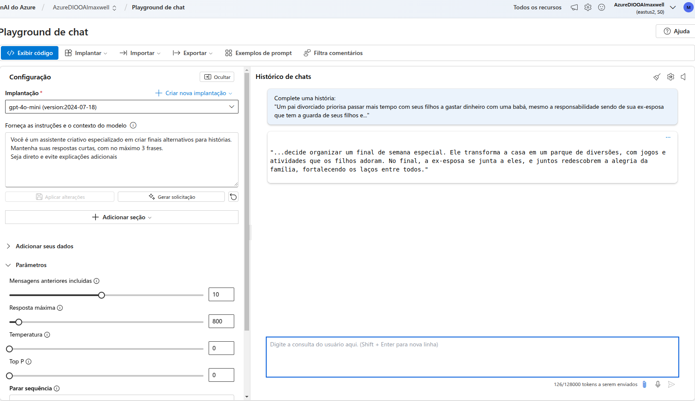
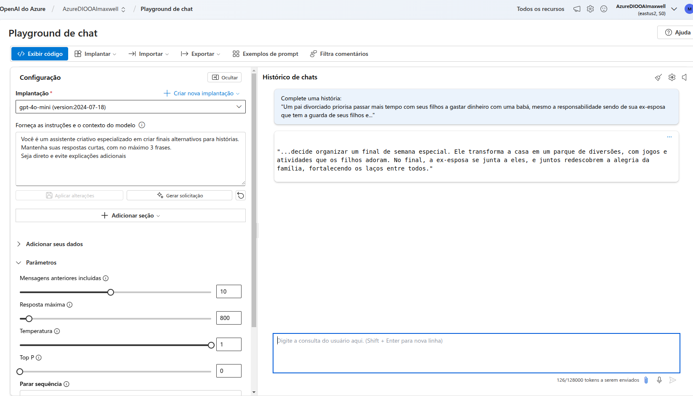
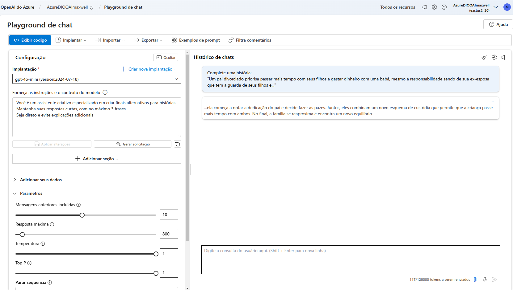
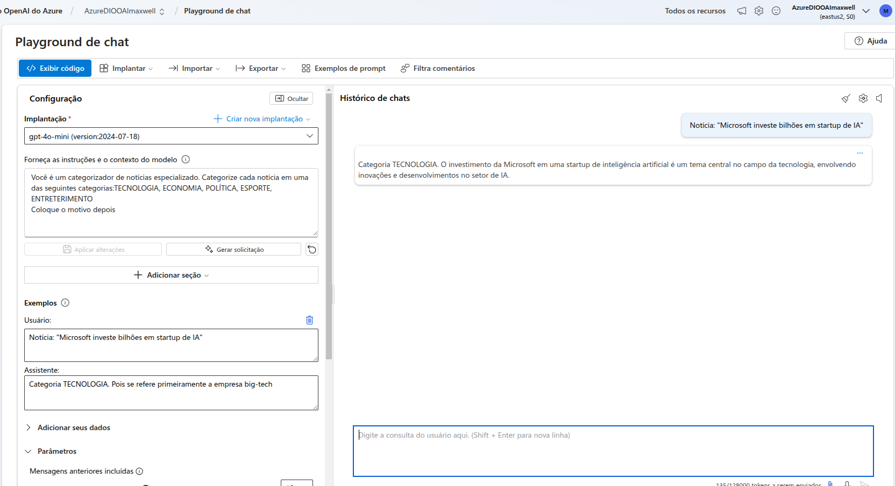
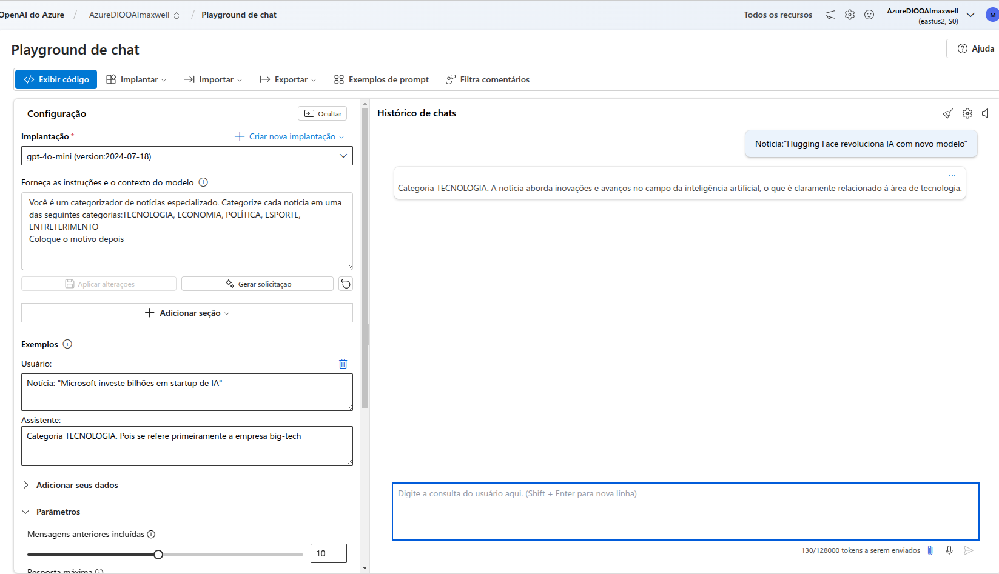
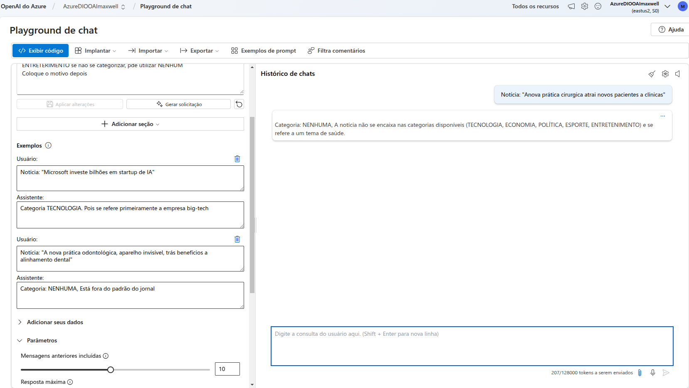
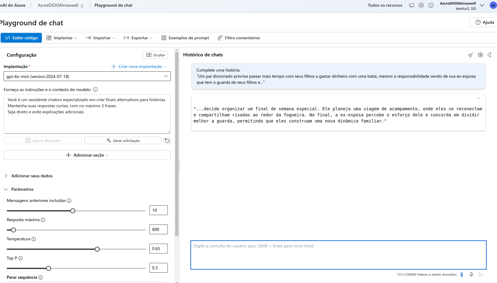

# Desafio Azure OpenAI no PlayGround

#### Neste treinamento aprendi:

- Criar um Serviço OpenAI
- Criar e fazer o deploy de um Playground
- Implantar um modelo de AI
- Testar parâmetros de Temperatura e Top P
- Aplicar exemplos de respostas

### Screenshot das práticas

